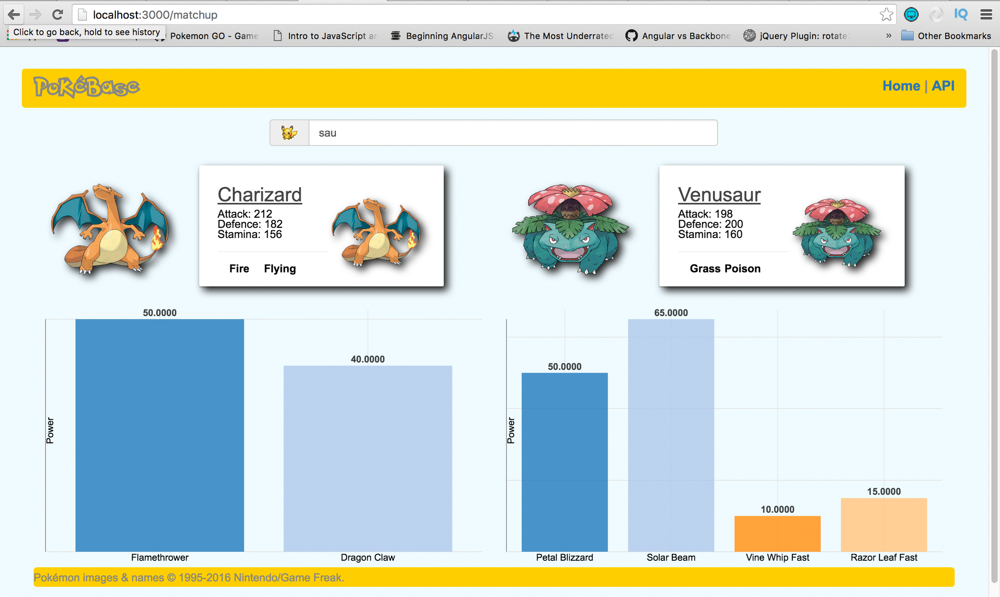

### http://pokebase.herokuapp.com/



# PokeBase

Public Pokemon GO API with information for all 151 Pokemon.
Still a work in progress.


## Installation

```
cd PokeBase
bundle install
rails db:create
rails db:migrate
rails db:seed
```
```
cd client
npm install
ng build
npm start
```
```
cd ..
rails s
```
